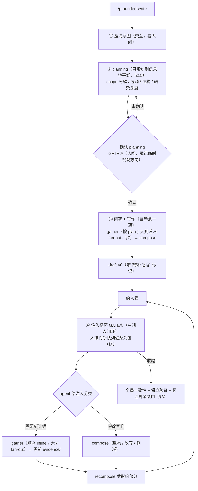

# agentic-studio 架构决策记录（v2.0）

本文是 agentic-studio 的权威架构决策记录（Architecture Decision Record）。每个重要选型都在此给出依据、对比方案与演进路径，面向三类读者：核心开发者、长期维护者、严肃外部评审。实做中若某条决策与现实不符，应在此处就地修订并标注日期，不在外部追加 patch 文档。

版本：v2.0（从第一性原理重写：可操作复杂度上限 → GroundedWrite）
最近更新：2026-06-06

> **血脉与本次重写。** v0.1（2026-05）曾论证「不用 LangGraph、自造会话层」。v0.1→v0.4（2026-06-03 至 06-05）是两次拍板的迭代：采用 **deepagents（on LangGraph）作 harness**，并把产品抽象从「三模式（write/modify/fill）」逐步收敛为「**grounded-write 单一能力**」。**v2.0（2026-06-06）是首次从第一性原理重写**：先确立项目的出发点（设计一个能最大化「可操作复杂度上限」的 agent runtime/harness）与控制论地基（状态不可遍历 + 信息历时 → 完备计划不存在 → 闭环被强制 → 宏观开环 + 中-微闭环），再把 grounded-write 作为这套地基的产品落地**导出**，最后才是平台与子系统。基础设施各节（DB 双通道、Skill 系统、检索、技术栈等）的工程结论沿用 v0.4，仅统一到新口径。v0.x 的转向证据链见 [`architecture-review-2026-06-session-layer.md`](architecture-review-2026-06-session-layer.md)，旧版保留在 git。
>
> 图示用 Mermaid（源 `docs/diagrams/architecture-v2.mmd`），不维护 SVG。

---

## 目录

**第一部分 · 第一性原理**
1. 北极星：可操作复杂度上限
2. 控制论地基
3. 架构不变量

**第二部分 · grounded-write（地基的产品落地）**
4. 单一能力
5. 控制结构落地：两棵分形子树
6. 生命周期与命令骨架
7. 并发与一致性
8. 验证、保真与判断队列

**第三部分 · 平台与契约**
9. 核心数据契约
10. 会话层：一次 create_deep_agent
11. 工作区协议
12. 分层与 deepagents 隔离纪律

**第四部分 · 子系统（基础设施）**
13. 索引层
14. 研究工具层（三粒度检索）
15. 数据库访问：双通道 · run_sql
16. Skill 系统：算子/控制器/地图 · 控制阶梯 · 渐进披露
17. 持久化 · Compaction · Docling

**第五部分 · 论证与工程**
18. 技术栈选型论证
19. 参考项目辨析
20. 八条支线
21. 实现路径与进度
22. 设计纪律
23. 未来待办
24. 术语对照

---

# 第一部分 · 第一性原理

## 1. 北极星：可操作复杂度上限

出发点不是「做一个写文档的 agent」，而是一个更基本的问题：

> **如何设计一个 agent runtime 与 harness，使一个人可操作的复杂度上限最大化？**

写成关系式：

```
可操作复杂度上限 = f(有限带宽, 抽象, AI 工具)
```

三个量的地位不同：

- **有限带宽**——人的注意力与判断力是定值，且稀缺。它是约束，不是变量。
- **AI 工具**——放大器（生成、检索、计算、工具调用）。它抬高 f 的天花板，但单靠它不够：没有正确的抽象，人会被 AI 产出的复杂度淹没，可操作上限反而降低。
- **抽象**——真正的设计变量。**正确的抽象**让有限带宽在高层级上操控大复杂度：人只在对的层级、对的时刻施加判断，底层复杂度由 runtime 吸收。runtime/harness 的全部价值，就是提供这套抽象。

由此导出两条贯穿全文的取向：

1. 产品的目标函数**既不是「AI 更自主」**（那会把人挤出环，复杂度上限由 AI 单方决定、且无人为其判断兜底），**也不是「让人审一切」**（那会压垮有限带宽，上限被带宽锁死）。目标是：**用正确的抽象，让稀缺的人类判断撬动尽可能大的复杂度。**
2. 衡量这个 runtime 的指标，**不是 benchmark 准确率**，而是：同一个人借助它，能把多复杂的研究/写作/分析任务**做到可交付**。

GroundedWrite（第二部分）是这套出发点的第一个落地——文档/报告/数据分析的生产，正是「人主导、AI 放大、靠正确抽象组织」的典型复杂任务。

## 2. 控制论地基

为什么这个 runtime 必然是闭环的、且是某种特定形状的闭环？这不是风格选择，是任务的认识论性质强制的。

### 2.1 两个事实

- **状态不可遍历**：真实任务的状态空间无法预先枚举。动手前你不可能把所有相关事实、约束、依赖、矛盾列全。
- **信息是历时性的**：新信息随时间到达，而非在某一刻一次给齐。读了一篇源才知道下一个该查什么；写了一段才发现某处自相矛盾；人看了草稿才说得清他究竟想要什么。

### 2.2 被强制的闭环

两个事实合起来 → **在起点或任何单一阶段，都不可能形成完备的计划（plan/research）。** 任何「先把计划与研究做完整、再执行」的架构都在与任务的认识论性质对抗，必然在信息到达时崩坏。

于是闭环不是「经验上好用」，而是**被强制**的：必须用反馈，在信息到达的当下就地纠偏。

**严格区分「被强制」与「被选择」。** 被认识论强制的**只有"必须闭环"这一件**。下文的 draft-first（§6）、判断队列（§8）、研究/写作双子树（§5）都是在此约束下的**设计选择**——well-motivated，但非唯一解（同样的前提也能导出别的形态，如"全自主、卡住才问人"的中断驱动）。本文凡用「强制/必然」只指闭环本身；属于选择的地方会明确标为选择，并给出选它的理由（而非伪装成定理）。

### 2.3 闭环的形状：递归的「承诺-纠偏」节点 + 稀疏的人环

控制结构是一棵**递归的「承诺-纠偏」树**，不是固定的三层。每个「做 X」都是一个节点：因 X 无法预先规划全（§2.2），先**开环承诺**一个方向（feed-forward），再在信息到达时**闭环纠偏**（feedback）；节点可分解成子节点，每个子节点又是一组「承诺 + 纠偏」。闭环能否成立，逐节点按同一判据判：**有无可观测误差 + 在有用时间尺度上有无可施加的纠正**。

正交地，叠一个**稀疏的「人环 flag」**：少数节点的纠偏环由**人**闭（设定点主观、杠杆高、不可自动校验），其余由 **agent** 闭（客观、可自检）。flag 之所以稀疏，是因为人带宽有限（§2.4）。

`macro / meso / micro` 不是三条定律，而是**这棵树里的相对深度**（描述性标签）。一个要点：**没有真正的开环节点**——每个节点都有纠偏，区别只在**频率与归属**。宏观节点的纠偏是人在检查点的**低频再承诺**（§2.4），所以它是"区间内 feed-forward、跨区间人采样闭环"，即最低频的闭环，而非无反馈。现实任务通常呈现为深度 2–3，于是有那句好记的 headline——**宏观（低频人闭环）+ 中-微闭环**；其中俗称的"宏观开环"只是"在一个采样区间内"的简写，不要当成"无反馈"。

| 树中位置（典型深度） | 纠偏频率 / 形态 | 谁闭纠偏环 |
|---|---|---|
| **宏观**：顶节点的方向 | 低频；区间内 feed-forward、跨区间闭环 | 人（采样式，§2.4） |
| **中观**：人环 flag 开的节点 | 中频闭环 | 人 |
| **微观**：agent 闭的节点 | 高频闭环 | agent（如字数/渲染/引用/retry 的自纠） |

这是分形定律在常见深度下的实例，不是地基本身。递归**有界**：深度 + 每层宽度 + token 预算封顶，叶子 = 单 agent 能直接处理的节点（§7）。

### 2.4 宏观是被采样的，不是永不纠正

宏观「开环」并非永不修正——人**只在中观检查点（即人环 flag 开着的节点，§2.3）重新承诺一次宏观方向**，两个检查点之间宏观 feed-forward 跑。换言之：

> 人是宏观上的**低频采样控制器**；agent 是微观上的**高频控制器**。

「有限带宽够用」的根因正在于此：人只在离散检查点花判断，不必连续盯。带宽省下来，可操作复杂度上限抬上去（呼应 §1）。

### 2.5 两条设计边界（全文的设计着力点）

既然结构是递归的「承诺-纠偏」树 + 稀疏人环（§2.3），runtime 设计的全部功夫就落在**每个节点的两条局部规则**：

- **边界一 · 每节点「计划只到自己的信息地平线」。** 不是全局一刀切——每个节点只规划到它当前可见的信息地平线就承诺、就产出；地平线之外的信息还没到，多规划必废或必错。这是 draft-first 的控制论根据（§6），且递归适用：子节点各自有更近的地平线。
- **边界二 · 人环 flag 落在哪些节点 ＝ 正确抽象的落点。** 能由 agent 自纠的（字数、渲染、引用、retry）不开 flag；只有需人判断的**枢纽**（矛盾、覆盖缺口、载荷性论断、方向是否要改）才开 flag、升入人闭环。flag 开得越少而越准，人带宽撬动的复杂度越大——这就是 §1 那个「抽象」的物理位置，也正是判断队列的入队判据（§8）。

这两条规则怎么定、谁来定（人 / agent / 确定性规则）、信息地平线怎么判断，是后续各节反复回到的问题。

### 2.6 与控制阶梯的关系（正交轴）

要把某个 invariant 硬持有，沿「软→硬」的控制阶梯加确定性控制：skill（软 setpoint）→ response_format（锁输出）→ middleware（每拍硬控）→ 子图（拓扑/停止条件）。这条阶梯（详见 §16）与本节的尺度分层**正交**：尺度分层回答「在哪个层级闭环」，控制阶梯回答「这个闭环里用多硬的手段守约束」。

## 3. 架构不变量

从 §1、§2 导出。实现可演进，这些边界不可破。

**不变量 1（能力）：单一产品能力 grounded-write。** 平台层是 workspace-based agent runtime（会话隔离、workspace-as-state、工具路由、skill 加载、checkpoint/resume）；其上只承载一个产品能力——基于资料搜集的写作。不存在并列的 write/modify/fill 模式或 gen/edit 家族；给定大纲即 fill 档、不给即 write 档、给定已有稿即 modify 档，皆为同一能力按**输入与配置**的变形。`deepresearch` / `专著` / `data-analysis` 等是 preset。

**不变量 2（控制形状）：递归的「承诺-纠偏」树 + 稀疏人环；常见实例为宏观开环 + 中-微闭环。** 闭环是认识论强制（§2.2、§2.3），非风格选择。任何「先求完备计划」的设计被拒绝。

**不变量 3（边界即设计）：每节点的两条局部规则是核心设计对象。** 每节点的信息地平线（计划到此即承诺）与人环 flag 的落点（＝判断队列入队判据）必须被显式设计与论证，不能默认（§2.5）。

**不变量 4（grounding 交付级、保真头等）。** 论断 ⊆ 证据 ⊆ 源、全程可追溯，是**交付时**的目标状态而非每刻保证（迭代中允许带已标注空缺）。风险集中在 evidence↔源**保真**，故保真验证为头等公民（§8）。

**不变量 5（主循环交 harness，硬约束交 schema/middleware/validator）。** deepagents 负责 agent loop、planning、工具调度、streaming、skill 加载、checkpoint；项目只在三处加确定性边界：工具参数、结构化输出、验证 middleware。

**不变量 6（契约分平台级与能力级）。** `WorkflowManifest`/`TaskSpec` 平台级（可序列化、可 registry 解析）；`RuntimeWorkflowSpec` 装配态（持有 Python class/callable）；`GroundedWriteSpec`/`SourceSelector` 能力级。稿件对象模型沿用 DoclingDocument，对外只暴露本项目 schema。

**不变量 7（VFS 默认数据边界）。** 每 session 一个 Mirage Workspace；稿件、证据、语料、模板、临时文件皆落工作区。Postgres 经 Mirage 暴露结构/抽样视图，聚合计算走受控 `run_sql` 例外（§15）。

**不变量 8（基础设施不重造 + 隔离纪律）。** 会话/VFS/文档模型/模型适配/skill 加载/checkpoint 交 deepagents/Mirage/Docling/LangChain；自造仅限检索、证据/稿件管理、验证、写作循环编排。deepagents/langgraph 只在 `infra/` 出现，藏在 `SessionEngine` Protocol 之后；`core/skills/tools` 对 harness 无知（§12）。

---

# 第二部分 · grounded-write（地基的产品落地）

## 4. 单一能力

grounded-write 是把第一部分落到文档生产的唯一能力（不变量 1）。一句话本质：

> 一份**稿件**，被**对着证据**写出来；系统同时维护——稿件中每项论断都扎在已搜集的证据上，证据又足够支撑要写的内容。

没有模式，只有**输入**与**配置**的变形：

| 旧「模式」 | 在 grounded-write 里 |
|---|---|
| fill | 多给一个 outline 作输入，照样有据写作填进去 |
| write | 不给 outline，agent 先拟纲再写 |
| modify | 多给一份已有稿作输入，写作闭环从它起步 |

输入 ＝ {意图、源选择、可选大纲、可选已有稿}；配置 ＝ {引用风格、篇幅、语言、产出类型}（schema 见 §9）。preset 只调默认配置，不增产品动作：`deepresearch`（web 为主、报告）、`专著`（本地语料为主、outline 驱动、长、学术引用）、`fill`（模板/大纲锁定）、`data-analysis`（DB 为主源、把分析结论 grounding 到查询结果，§15）。

## 5. 控制结构落地：两棵分形子树

### 5.1 研究子树 / 写作子树

把 §2.3 的递归「承诺-纠偏」树落到 grounded-write：它是**两棵分形子树**，区别**只在人环 flag 接没接进来**——不在粒度（这纠正了"研究=微观、写作=中观"那种把两条轴叠成一条的范畴错误）。

- **研究子树（节点内 flag 全关 → 可无人值守）**：因「查询路径不可预先指定」（§2.1），每个研究节点都是「承诺一个查法 → 看结果 → 改查」的闭环。flag 全关指**节点内部**人不参与、agent 自主跑（后台/批量），是 §1「AI 工具放大器」对有限带宽最直接的释放——但研究仍被人在**边界**触发与约束（GATE①、GATE② 的 gather），"无人值守"是 v0 自动段的性质，不是范畴性的。它内部按 §2.3 递归展开——浅则单 agent 自主，大 scope 则 planner 控树的递归 map-reduce（§7）。
- **写作子树（在 meso 节点开 flag → 必须人在环）**：因「意图不可预先指定」，主观设定点只在迭代中显形，故在中观节点开人环 flag——出稿 → 人看 → 注入 → 改（GATE①/GATE②/判断队列，§6、§8）；其 micro 节点仍由 agent 自纠（字数、图、引用、retry）。

两棵都是「承诺 + 纠偏」的分形树，本身都含 meso/micro；它们**不在粒度上对立，只在「人环 flag 接没接进来」上分野**。严格说不是平行两棵——**写作树的节点可嫁接研究子树**（下方回边）；称"两棵"是强调它们作为**模块**解耦：嵌套调用不破坏模块化，各自仍可独立推理、测试、替换、缓存。二者通过共享 workspace 状态（`evidence/` 与 `manuscript`）连接，受控回边为：写作节点发现 grounding 不足 → 调起研究子树（§6 GATE② 的 gather 分支）。解耦不指时间先后——执行中交错。模块化的回报：贵的搜集跑一次、写作迭代多次复用，以及按 scope fan-out（§7）。

### 5.2 控制模式与升级判据

`ControlMode` 回答「这段流程的外层由谁控制」。grounded-write 随树形与 flag 落位，需点明一个看似矛盾实则一致的事实：

- **整体 = `HYBRID`**：因为有 GATE①（计划确认）这道**确定性人闸**——它是必须经过、可强制的中观节点。
- **闸之间的研究+写作段 = `CLOSED_LOOP`**：默认是「流畅单环」（顺序、agent 自主、不分段，§7）。所以**「外 HYBRID、内 CLOSED_LOOP」并不矛盾**——HYBRID 指那几道确定性闸，CLOSED_LOOP 指闸之间的自主闭环段。

升级判据（呼应 §22 纪律 9「在观察到的缝上切，别预建」）：

| 触发 | 该节点的形态 |
|---|---|
| 默认 | 流畅单环（`CLOSED_LOOP`） |
| 某研究节点 scope 大到单上下文装不下 | **局部**切并行档：planner 控递归 map-reduce（barrier + 不相交切片 + 确定性 merge，§7），偏 `HYBRID`/`GRAPH`，但只局部、不波及全局 |
| 恢复点须落阶段边界 / 审批须强制 / 拓扑须可复现 | 该部位升 `GRAPH`（私有图） |

`WorkflowRunner` 仍是薄分派（按 manifest 选 session 或私有图），不新增与 `SessionEngine` 平级的引擎。

## 6. 生命周期与命令骨架

入口是一个命令（`/grounded-write` 或 CLI `run grounded-write <spec.json>`）。它先自动跑一遍「研究—写作」得到初稿 v0，再转入人不断注入的交互循环。人有**两道介入点**，性质不同：



控制论读法：

- **GATE① 是顶节点的承诺点**（边界一）：planning 只规划到信息地平线，确认的是一个**临时宏观方向**而非完备计划；确认前不烧研究预算。
- **draft-first（设计选择，非控制论必然）**：控制论只逼出"信息不全时先承诺**某物**"；选它是**整篇草稿**而非仅一份计划，理由在**判断带宽**——人对着**具体草稿**才能给出高带宽判断（草稿把矛盾/缺口/载荷论断暴露成可裁决的对象，§8），抽象计划做不到。v0 不是空草稿：按已确认 plan grounding 而成，地平线之外的长尾留给注入循环按需补。研究因此**渐进式、需求驱动**：人的反应把贵的研究拉到要紧处。
- **GATE② 是中观人闭环**：每条注入先**分类路由**——需要新证据走 gather（默认顺序 inline，需求大才 fan-out），只改写作走 compose，两者都要则 gather 后 recompose。
- **判断队列**（§8）是边界二的落点：agent 把最该由人判断的枢纽顶出来，让人在每个检查点的有限判断花在最高杠杆处。

## 7. 并发与一致性

执行形态随 scope 在两档间切换，分段恰好出现在并行处：

> **顺序工作流畅、不分段；并行工作必须分段（barrier + 不相交切片）。**

- **顺序档（scope 小 / inline 核实）**：单 agent，一次一个调用，读得到自己刚写的，无并发竞争——流畅交错 gather/compose/verify，不需 barrier。这是默认形态。
- **并行档（scope 大 / fan-out）**：scope 超出单上下文时拆子 agent 并发。直接「不分段 + 异步」会出三类故障——在不完整证据上写、共享 `evidence/` 写写竞争、完成顺序致不可复现。解法是把分段放在并行边界：①并发 fan-out 用 **join barrier**（spawn → await 全部 → merge → 才被消费）；②每个子 agent 写**不相交切片** `evidence/<scope>.md`（无写写竞争）；③**确定性 merge**（按 scope id 排序/去重，与完成顺序无关）；④写手只消费 join 后快照。

scope 分解天然**递归**（主题→子主题→…，直到叶子可被单 agent 直接 search→read→distill），形成一棵 map-reduce 树，每个 reduce 是一道 barrier。递归须封顶（深度 + 每层宽度 + token 预算），且**递归住在 planner 的控制流里**（代码控树、按层分批 spawn 叶子、自下而上 merge），不是 agent 自己再 spawn agent。长文取**逐节 barrier**：某节 scope 一 join 即开写该节，其它节研究继续；跨节一致性由收尾全局 pass 统一校验（§8）。

### 7.1 递归多 agent fanout（as-built，已实测）

"大量 research"的核心机制，落在 [`infra/research/fanout.py`](../agentic_studio/infra/research/fanout.py)。每个节点：planner 决定 → 可再拆且未到 `max_depth` 则 **fan-out 子节点（子节点可再 fan-out，即 fanout 的 fanout）**；否则作叶子跑研究子环（§14.1）。六个要件：

1. **语料感知 + 发散 planning**：拆 scope 前先 `survey` 普查语料，**按"语料确有什么"来拆**——防盲拆漂移/空支，并让深度自适应语料丰度（丰则拆深、薄则成叶）。普查用 **MMR（最大边际相关，`embed.mmr_topk`，relevance−redundancy 贪心）** 选**多样代表**而非 top-K，配发散提示（覆盖不同侧面、含边缘角度、不挤热门、MECE）→ 子范围**铺开**而非塌向中心。关键：**发散靠多样化采样输入 + 提示，不是靠去重**（去重只删结果、不改塌缩成因）。
2. **广度均分预算**：`max_leaves` 自顶向下按子节点均分（每支配额=父预算/分支数，余数补前几支；不够则只跑前 budget 支各 1）——防深度优先消耗、早分支饿死晚分支。
3. **并行限流（多 agent）**：叶子研究由 `Semaphore(concurrency)` 并发；内部节点用线程等子节点（廉价、避免嵌套线程池死锁）；共享 GPU embed 用锁串行化（query 编码很快）。
4. **确定性 merge（reduce）**：按 `node_id` 去重、取最高重要性、累计 scopes/notes，结果与完成顺序无关。
5. **bridge 提档**：被 ≥2 个 scope 命中的节点 = 跨子主题的中心证据 → 重要性提一档（harness-1 evidence-graph 思想，§19.4）。
6. **落盘**（workspace-as-state）：`evidence/manifest.json`（node_id→重要性/命中 scope/notes）+ `pool.md`（bridge 排序），可恢复/审计；全文经 node_id 回取。

**封顶变量**：`max_depth`/`max_width`/`max_leaves`/`concurrency`/`leaf_max_turns`（token 预算档列 §23 待办）。

**实测（2026-06-08，2568 篇洪水语料，§21）**：广任务递归拆 → **15–18 个并行研究 agent、墙钟 66–80s**（顺序估计 12–24 分钟，**压缩 ~10–18×**）→ 确定性合并；bridge×scope 排序自动浮出全题奠基文献（黄河溃堤数学模型、唐家山溃口流量/洪水演进、溃坝数值模拟综述、堰塞坝溃决综述、水沙耦合模型…）。**发散 tuning 已验证**：早期"语料感知 top-K planning"提相关性却使 scope 向中心收敛（去重证据 29、bridge 占比 59%、"梯级水库溃坝应急"在 3 支重复）；改为 **MMR 多样普查 + 发散提示**后 → 去重证据 **77（+165%）**、bridge 占比降至 **27%（−32pt）**、子范围真正铺开（水沙数值/动床输沙/冰塞冰湖/黄河溃堤/经验模型/简化物理/贝叶斯实时预报/灾害链/梯级调度各占一支），同时真正横切的奠基文献仍被 bridge 正确提档（黄河溃堤数学模型、唐家山溃口流量数值模拟 各 scope×10；溃坝/堰塞坝综述类 scope×5–6）。⇒ **发散与 bridge 提档两机制互不打架**：前者让子范围铺开，后者让真正的全题基石升权。

## 8. 验证、保真与判断队列

验证分三层，且为「判断队列」供料。

**Hard gate（确定性、当场过）**：schema 字段齐全（`with_structured_output`）、anchor 可解析、编辑算子 dry-run 成功、引用的 `[doc_id]` 真实存在于索引、文件 slug 合规。失败注入错误让 LLM retry（≤3 次），仍失败走 `force_final_answer`。

**保真验证（evidence↔源，头等公民）**：grounding 的真正风险不在控制拓扑，而在 agent 写出**看着 grounded、实则曲解源**的论断（伪造引用、读错原文、库里数过期）。hard gate 只能验「引用存在」，验不了「证据忠于源、论断忠于证据」。故保真独立成层：对**载荷性**论断/数值/公式，重读其源（`read_doc` 原文 / `run_sql` 现查 / web 复核）与论断比对，输出 supported / contradicted / not-mentioned。**默认单 verifier（temp=0）**；不要用 temperature 重采样的"伪 ensemble"——实测零增益甚至有害（见下）；需要多裁判时必须**视角多样**（不同提示 / lens / 模型），而非同分布重采样。它由「载荷性」触发而非逐句跑，收尾做一次全局覆盖，也是写作回边「补研究→校验」（§6）的落点。**矛盾检测**是保真的一等子任务：源↔源不一致、论断↔源不符，都要被识别并升入判断队列。

> **实测（2026-06-06 探针，§21）**：摘要级、清晰矛盾（数值翻转、方向反义、not-mentioned），单 verifier(temp=0) 在 60 条**确定性构造**样本上 **60/60、0 危险漏判**；3 票 temp=0.7 重采样反而 59/60（净负）。⇒「抓明显曲解」这一档可靠，且**单 verifier 优于重采样 ensemble**。**仍未验**：全文级源 + "似是而非的微妙误读"（须"上原文 + LLM 生成似真假论断"补测，列待办）。

**Soft fail（可推下一轮）**：覆盖度、字数达软目标、段落/列表比例、首段叙述性、引用资源下限。每轮末 LLM 答 Yes/No 写入自检日志，「No」转下一轮 TODO。

**判断队列（边界二的产物，§2.5）**：可操作复杂度上限的瓶颈是人的判断带宽，故 runtime 的核心动作不是「更自主」也不是「让人审全部」，而是**把压倒性的复杂度转换成一条按杠杆排序、可逐条处置的判断队列**喂给人。入队的是高杠杆枢纽：保真层发现的矛盾、覆盖缺口、载荷性但未核实的论断、一次没写好的段、方向是否要改。人在 GATE② 只裁决这些；微观可自纠的不入队。判断队列把「人在环」从「人想起来才注入」升级为「agent 主动呈递 + 人逐条裁决」，是 grounded-write 相对无人值守范式（§19）最核心的差异化机制。

**诚实标注（这是开放问题，不是已解机制）**：「入队判据」本身是一次判断（"什么该让人判断"），存在 triage 难度甚至潜在回归——它是本架构**最关键也最未解**的部分。v0.1 不假装解决，用启发式：保真层产出的矛盾、覆盖自检的缺口、收尾未核实的载荷论断**直接入队**；"按杠杆排序"先用粗启发（矛盾 > 缺口 > 风格）。这块连同 draft-first 的具体形态，是 §19.1 标注的**核心赌注**，须靠实验校准（§21）。

收尾再做一次**全局一致性 pass**（跨节/跨稿术语与数值一致，补偿 §7 逐节 barrier）并输出剩余 `[待补证据]` 缺口清单（诚实标注待人工核项）。循环内置轻量 give-up 检测（约 10 个中英双语 regex），命中则 discard 当前轮 trace 重跑（≤N 次）；完整 ensemble/discard-all（Marco TTS）作 v0.2 质量小件（§19）。

---

# 第三部分 · 平台与契约

## 9. 核心数据契约

全部纯 Pydantic v2、零 infra 依赖，作为 tool 参数与 structured output 使用，与 [`agentic_studio/core/`](../agentic_studio/core/) 对账。分平台级 / 能力级 / 稿件级 / 索引级。

### 9.1 平台级：Manifest / TaskSpec

```python
class ControlMode(str, Enum):
    CLOSED_LOOP = "closed_loop"; HYBRID = "hybrid"; GRAPH = "graph"

class WorkflowManifest(BaseModel):       # 首批只注册一个能力
    workflow_id: str = "grounded-write"
    preset: str = "default"              # deepresearch / 专著 / data-analysis / fill
    control_mode: ControlMode = ControlMode.HYBRID   # 宏观闸 + 中微闭环，见 §5
    input_schema_id: str = "GroundedWriteSpec"
    skills: list[str] = []; tools: list[str] = []
    validators: list[str] = []; output_artifacts: list[str] = []

@dataclass
class RuntimeWorkflowSpec:               # 装配态，持有不可序列化对象
    manifest: WorkflowManifest
    input_model: type[BaseModel]         # = GroundedWriteSpec
    graph_factory: Callable | None = None

class TaskSpec(BaseModel):
    task_id: str
    workflow_id: str = "grounded-write"; preset: str = "default"
    workspace_path: str
    inputs: dict = {}                    # 由 GroundedWriteSpec 校验
    config: dict = {}
```

没有 `mode` 字段（不变量 1）。`WorkflowManifest`/`TaskSpec` 可写入 `.task.json`、可被 registry 解析；`RuntimeWorkflowSpec` 才持有 Python class/callable/graph factory。

### 9.2 能力级：GroundedWriteSpec / SourceSelector

```python
class DocCorpus(BaseModel):              # 本地文档语料源
    index_path: str                      # IndexEntry 列表（如 cards.json）
    embed_cache: str | None = None       # bge-m3 文档向量缓存（.npz，§14）
    content_root: str | None = None      # 原文根（read_doc 读全文）

class SourceSelector(BaseModel):         # 研究子环的活源集合（§5）
    use_web: bool = False
    dbs: list[str] = []                  # 只读库别名 /db/<alias>（§15）
    docs: DocCorpus | None = None

class OutlineSection(BaseModel):
    id: str; title: str
    word_count: int | None = None        # 软目标（§6 measure→expand）
    content: str = ""; key_question: str | None = None

class GroundedWriteSpec(BaseModel):
    intent: str                          # 写什么 / 目标
    outline: list[OutlineSection] = []   # 给了即 "fill" 输入档
    draft_path: str | None = None        # 给了即 "modify" 输入档
    sources: SourceSelector = SourceSelector()
    citation_style: str = ""; language: str = "中文"
    length_target: int | None = None; config: dict = {}
```

### 9.3 稿件级：Article / Block / 编辑算子

Article 是稿件统一抽象（底层 DoclingDocument），Block 是逻辑单元，经 `docling_ref`（如 `#/texts/3`）指向节点；`FillMode` 标注块是原样/待按指令填/空待填，服务 fill 输入档。写作子环对稿件的修改默认走 deepagents 内建文件编辑 + Docling adapter 的 anchor 读改删（§17）；需要可校验/可 dry-run/可生成 diff 时，用 `EditOperation` 判别联合（Anchor 族按 DoclingDocument anchor、Text 族按字面定位，`op` 判别）——它是写作子环 compose 的**内部工具 schema**，不是独立产品动作。

### 9.4 索引级：IndexEntry

```python
class IndexEntry(BaseModel):             # 每文档一条题录（早期叫 Card）
    doc_id: str; title: str
    authors: list[str] = []; year: int | None = None; abstract: str = ""
    venue: str | None = None; keywords: list[str] = []
    doi: str | None = None; issn: str | None = None
    impact_factor: float | None = None; cited: int | None = None
    content_path: str | None = None; content_kind: str | None = None
    extra: dict = {}
    def embed_text(self) -> str: ...     # title + abstract，供文档级 embedding
    def row(self) -> str: ...            # 一行 grep 友好文本，供 keyword_search / 导航
```

### 9.5 Session / Turn

Session 落 `workspace/.session.json`（产品语义层会话摘要），`resume` 据它决定恢复哪个 preset/stage/round/`thread_id`。三处持久化：工作区文件→Mirage VFS、会话线程态→deepagents checkpointer、Session 摘要→JSON（§17）。Turn 记录写作子环里人的每次注入与 agent 响应，`intent` 标注该注入被分类为 gather 还是 compose（§6 GATE②）。

> **迁移说明（as-built ≠ target）**：当前代码 `TaskSpec` 仍含遗留 `mode: Mode`（带 `_fold_legacy_mode`），`core/workflow.py` 有 `WorkflowManifest`/`RuntimeWorkflowSpec`/`ControlMode`/`MonographBrief` 前身。下一步删 `Mode`、立 `GroundedWriteSpec`/`SourceSelector`，把 `monograph`/`deepresearch` 注册为 preset（§21）。

## 10. 会话层：一次 create_deep_agent

会话层收敛为一次 `create_deep_agent(...)`，装配在 [`infra/deepagents_engine.py`](../agentic_studio/infra/deepagents_engine.py) 的 `DeepAgentsSession`，对外实现 `SessionEngine` Protocol：

```python
session = create_deep_agent(
    model="anthropic:claude-sonnet-4-6",                 # 模型无关；DeepSeek 走 OpenAI 兼容端点
    backend=LangchainWorkspace(mirage_ws, session_id=sid),  # 每 session 一 Mirage Workspace = 隔离 VFS
    skills=["/skills/grounded-write",                    # 核心能力 skill（编排生命周期，§6）
            "/skills/corpus-research",                   # 研究子 agent 导航硬规则
            "/skills/db-analysis", *corpus2skill_output],
    subagents=[research_subagent],                       # fan-out 用（§7）
    tools=[semantic_search, keyword_search, read_doc,    # 三粒度检索（§14）
           run_sql, list_databases,                      # DB 双通道（§15）
           count_words, render_mermaid,                  # 写作子环客观自检（§8）
           *web_tools, *docling_tools],
    middleware=[summarization_middleware,                # compaction
                verification_middleware],                # hard-gate / 保真（§16 控制阶梯硬档）
    checkpointer=checkpointer,
)
```

职责归位后自造面收窄到：检索、证据/稿件管理、验证（含保真与判断队列）、写作循环编排。当前实现是最薄闭环版本，产品化时按需加 middleware/subagent/私有图——都在 `SessionEngine` 边界内替换，不动 core schema。

## 11. 工作区协议

每 session 一个 Mirage Workspace（`DiskResource(root=workspace)` 挂 `/`）。布局直接映射两个子环的共享状态（§5）：`evidence/` 是研究产物兼接口（可缓存复用），`manuscript.md` 是写作稿件，`plan.md` 是 GATE① 确认的临时计划，`judgment_queue.md` 是 §8 呈递给人的判断队列。

```
<workspace_root>/
├── .task.json / .session.json
├── plan.md                 ← clarify + planning 产物（GATE① 确认，§6）
├── evidence/               ← 研究子环产物 = 接口（§5、§7）
│   ├── manifest.json       ← scope→覆盖哪些节、引了哪些 doc_id；确定性 merge 用
│   ├── <scope>.md          ← 不相交证据切片（带 [doc_id] 引用）
│   └── sources/            ← 原始网页 / 原文片段归档
├── manuscript.md           ← 写作子环稿件（迭代中可带 [待补证据]）
├── judgment_queue.md       ← 按杠杆排序的待人裁决项（§8）
├── inject_log.md           ← GATE② 注入记录与分类（gather/compose）+ 轮次自检
├── references.md           ← 收尾参考文献表
└── .index/                 ← 语料源索引（§13）
    ├── _manifest.json / entries.json / embed/ / skills/
```

状态标记统一：`[TODO]` / `[IN-PROGRESS]` / `[COMPLETE]` / `[ALL COMPLETE]` / `[SUPERSEDED]`。文件命名两条硬规则（借鉴 FS-Researcher）：禁占位名（`notes.md`/`tmp.md`），自解释；slug 英文小写连字符（即使主题中文）。preset 只改取舍：`deepresearch` 源以 web 归档为主、`manuscript.md` 即报告；`专著` 按 outline 分节、`evidence/<scope>.md` 与节对应；`data-analysis` 源以 `/db` 为主、证据多为查询结果；`fill` 带 `template.md`；`draft_path` 给定时原稿先载入 `manuscript.md`。

## 12. 分层与 deepagents 隔离纪律

四层严格约束（不变量 8）：

1. `core/`——纯数据契约（Pydantic），不导入 Mirage/Docling/LangChain/deepagents。
2. `tools/`——自写差异化工具（如三粒度检索）写成**纯 Python 函数**，仅依赖 `core/`；装配层用 langchain `@tool` 包装。
3. `skills/`——`SKILL.md`（能力 skill 与知识 skill），不含可执行的第三方耦合。
4. `infra/`——适配层，把第三方接口封成本项目 Protocol，是**唯一允许 import deepagents/langgraph/mirage/docling 的边界**。`session/` 装配层依赖 `infra/` 选定的引擎，对外只返回 `SessionEngine` Protocol；`cli/` 是入口。

`SessionEngine` 定义在 [`infra/session.py`](../agentic_studio/infra/session.py)（本文件不导入 deepagents），是隔离边界的代码落点。这保证两件事：切换底层（含整体换掉 deepagents、退回裸 LangGraph）不动 schema 与业务；deepagents/LangChain 的 API churn 被局限在 `infra/` 一处。例外：`run_sql`（§15）天生耦合 Mirage 连接池与常驻 loop，放 `infra/db_tools.py` 而非 `tools/`——约束 2 针对纯逻辑工具，与基础设施同生共死的工具留 infra。

---

# 第四部分 · 子系统（基础设施）

本部分是研究子环所依赖的活源与索引、skill 的控制结构、持久化与文档接入。结论沿用 v0.4 实测，口径统一到 grounded-write。

## 13. 索引层

索引层不做 retrieval，而是给 agent 一张可导航的语料地图（retrieval 由 §14 负责）。由 Corpus2Skill 风格的编译流水线产出，**一次编译产出三件运行期产物**：（1）`SKILL.md` 导航树（知识 skill）；（2）文档级向量（`semantic_search` 召回用）；（3）`entries.json` 的 `IndexEntry` 列表（`keyword_search` / 导航用）。

三个层次：**L0** manifest（文件清单 + size/mtime/content_hash/file_type，由 Mirage `fingerprint()` 零成本获取，无 LLM）；**L1** `IndexEntry`（§9.4，每文档一条题录，按 content_hash 缓存）；**L2** SKILL.md 导航树（整个 corpus 编译为 Anthropic Skills 风格层级目录，跨章节关联用 entity-Jaccard，推迟到 v0.2）。L2 正是大规模 knowledge skill 的渐进加载形态（§16）。L0/L1 schema 在 L2 升级时保持不变。

### 13.1 大文档 = 子语料：节点树 + 分级路由

上面的 L0/L1/L2 是**跨文档**的地图（语料→文档）。但当单个文档很大（书，几十~几百万字），"一篇一向量 + 读整篇"失效。解法是把索引做成**分形的**（与 §2.3 分形控制、§7 递归同构）——**一本大书当成一个子语料，递归套用同一套机制**：

- **索引单位从"文档"升为"递归树里的节点"**：`corpus → 书 → 章 → 节(叶)`。小文档 = 叶；大书 = 子树。`IndexEntry` 泛化为树节点（加 parent / level / span / children）。**叶节点 = 语义完整的"节"，仍非定长 chunk**（§14 不变量保住）。
- **叶节点用全文向量路由**，不用有损摘要——**实测（§21）"前200字"摘要向量比节全文向量 R@5 低约 13 点**（洞 B）。
- **分级路由（规模机制）**：上层节点用"子节点向量质心（+可选 LLM 摘要）"代表；查询**逐层剪枝**（书→章→节），避免与全部叶节点平铺比较。它拿"召回安全"换"规模"，故配四个兜底：每层留宽、全文 grep 并行、agent 看标题导航、读+核对收尾。
- **何时开**：小语料平铺即可（实测 814 节 flat **R@5 0.93**）；几万节以上才上分级。分级 vs 平铺的召回对比**待跑**（§21）。
- **洞 A（脏文档 / 扫描件结构不可靠）暂列待办**：本设计假设标题基本可用；OCR 书的鲁棒分段（结构置信度门 + 退化为重叠窗口）留 v0.2。

## 14. 研究工具层（三粒度检索）

照搬 A-RAG 的三粒度设计 + Mirage 内置文件类工具 + web 搜索。核心是 **push-pull**：search 只返 snippet，强制后续用 read 拿全文，避免一次性 dump 全文的 token 浪费，并让 agent 显式表达「细读哪些」。

**检索三分（不是 vectorless vs vector 二分）**：

| 角色 | 决议 | 理由 |
|---|---|---|
| chunk-RAG **作答** | **拒绝**（KohakuRAG 路线） | 切块丢上下文、从片段作答、多跳脆 |
| 文档级 embedding **Hop-0 召回**（路由器）＝ `semantic_search`（大文档泛化为**节点级**，§13.1） | **接受** | 一篇/一节一向量、不切块、只粗筛（如 2568→~30）、不作答；跨语言（中↔英）keyword 给不了 |
| serve-time 推理/阅读/改写 ＝ `read_doc` | **vectorless** | 整篇 DoclingDocument + anchor；全上下文、可调试；多跳交给 agent |

不变量：*不切块、不从片段作答、推理始终在完整单元（整篇 / 大文档的一节，§13.1）上；embedding 仅限文档级 / 节点级 Hop-0 召回。* 三个自写工具（纯函数，装配层包 `@tool`）：`semantic_search`（bge-m3 文档级召回）、`keyword_search`（FTS，在 `IndexEntry` 字段与 L0 范围内）、`read_doc`（按路径/anchor 进原文，Docling load + 文内 grep，标记已读避免重复）。`grep`/`glob`/`ls` 等用 deepagents 内建 fs（经 Mirage），不重造。

### 14.1 研究子环的状态与工具（参照 harness-1，§19.4）

研究子 agent 是个**状态外置的检索 harness**：harness 持可恢复状态、policy（LLM）只做语义决策。状态模型与工具集照 harness-1 落地、按我们语境改写：

- **状态 = `WorkingMemory` 式两层记忆**：内层（进上下文的紧凑文本：候选池 doc_id + snippet + 检索史）+ 外层（`doc_store` 全文，零成本重读）。这是 §11 `evidence/` 的运行期形态。
- **证据精选层 `curate`**：在候选池之上维护一个**带上限 + 重要性标签（very_high/high/fair/low）+ 减法淘汰**的精选集——它就是喂写作闭环、最终带 `[doc_id]` 落 `evidence/` 的证据（区别于 harness-1 的"curated=最终答案"）。
- **保真工具 `verify(doc_ids, claim)→yes/no+理由**（compute-only，不耗语料 token）：标 very_high / 入证据前调用，即 §8 保真层做成 policy 可调工具。
- **`review_docs`**：从外层全文零成本重读（push-pull 的"读"侧）。
- **`end_search`**：policy 显式判定"证据已足够"（覆盖度自检的工具化）。
- **纪律进 `corpus-research` skill**：search→curate 节奏、backtracking（卡住先在 reasoning 里说清再换策略）、evidence-graph 多跳信号（bridge 实体高价值、singleton 是潜在 hop）。

不取其 RL 训练与 Chroma/chunk 检索（我们 frontier+skill + bge-m3 节点级，§19.4）。

**借鉴 Corpus2Skill / A-RAG 的 grounding 硬规则**（进 `corpus-research` skill）：先扫索引再读原文、导航材料≠证据材料（claim 只能引全文）、每个论断必读源、≥2 候选路径存活 + entity 横跳防漏检、不编造。embedding 已定 `BAAI/bge-m3`（本地、跨语言），走 GPU（torch cu128），文档向量编译期算好缓存为 `.npz`（§21 实测 2568 篇通过）。

## 15. 数据库访问：双通道 · run_sql

不变量 7 在结构化数据源上的落地，已实测通过。一个会话可连多个 Postgres；交互遵循**双通道**：

| 通道 | 干什么 | 怎么走 |
|---|---|---|
| **VFS 文件视图**（探索/抽样，只读、懒查、有上限） | 看有哪些库/表/列、看几行样例 | `list_databases`；`cat /db/<别名>/database.json`（跨表 FK）、`cat .../schema.json`（列/类型/主外键）；`head`/`grep .../rows.jsonl`（被自动下推成 SQL） |
| **run_sql**（计算） | JOIN / 聚合 / GROUP BY / 跨表过滤 | `run_sql(database, sql)` |

判据：要碰超过几行/拼表/算 → SQL；只看结构/几行样例 → VFS。**schema 是 run_sql 的前置 grounding（刚需，非建议）**：先读 `database.json`（FK 图）→ 读涉及表 `schema.json` → `head` 抽样 → 才写 SQL（防列名/连接键幻觉）。这是 data-analysis preset（§4）研究子环的主源。

**run_sql 实现（as-built）**：复用 Mirage 只读池（`PostgresResource.accessor.pool()`，服务端强制 `default_transaction_read_only=on`）；绑常驻事件循环（`run_coroutine_threadsafe`，避 asyncpg 跨循环 `InterfaceError`）；纵深护栏（单语句、拒写、自动 LIMIT、`statement_timeout`、JSON 安全序列化）；多库注册表 `DbHandle` 各挂 `/db/<alias>`，`list_databases` 暴露（因嵌套挂载下 `ls /db` 不枚举子挂载）。**python-open 陷阱**：deepagents 的 bash/python 跑在真实子进程，看不见 Mirage 进程内 VFS monkeypatch → `python open('/db/...')` 在 Windows 子进程被解析成 `<盘符>:\db\...` 报错；故 DB skill 明令禁 `python open`/`os.listdir`，浏览用 cat/head/grep、计算用 run_sql。**大数据下推不搬运**：SQL 表达得了的聚合在库里算、只回小结果（实测 2178 行事实表→21 行答案，毫秒级）。

## 16. Skill 系统：算子/控制器/地图 · 控制阶梯 · 渐进披露

**加载机制（as-found）**：skill 本身是 deepagents 的 `SkillsMiddleware`，渐进披露现成——`before_agent` 每会话只加载 frontmatter（name+description）入 system prompt，命中描述时模型**自己 `read_file` 读正文**，body 永不自动注入。故 skill 是**纯软控制**（调 setpoint，不强制流程/不 scope 工具）。我们造的是「靠 description 自路由的目录」，质量 = description 质量 + 目录组织质量。

**三类**：

| 类 | 控制结构 | 例 |
|---|---|---|
| 原子操作 skill（算子，无环） | 有界、会终止、可组合的单步契约 | write-section、count-words、render-mermaid、verify-claim、answer-from-query |
| 闭包 workflow skill（软控制器，有环） | 自带轮次/自检/终止/跨轮状态 | grounded-write 生命周期、corpus-research 检索环、db-analysis 探索-查询-精修 |
| knowledge skill（地图） | 被导航、非被运行 | Corpus2Skill 导航树 |

把 workflow 分解成原子操作，正是让闭环可控的机制——控制器架在「小而有界、可自检的算子」上才稳定（§2.3 微观闭环的工程依据）。

**控制阶梯（软→硬，§2.6）**：skill（软 setpoint）→ response_format（锁输出 schema）→ 自写 middleware（`wrap_tool_call`/`wrap_model_call`，每拍硬控）→ workflow 私有图（拓扑+停止条件）。要硬持有的 invariant（终止保证、每拍校验、输出契约、可复现）落 middleware/图，不靠 skill。「啥时候加载哪个 skill」由 description 匹配驱动（模型驱动，不焊死 dispatcher）；规模化靠导航树逐级 prune。**DB 双通道即此模式**：`db-analysis`（顶层）→ `list_databases`/`schema`（地图）→ `run_sql`（取数，= `get_document` 角色）。

## 17. 持久化 · Compaction · Docling

**持久化三层**（须明确真相归属）：工作区文件→Mirage VFS（单一真相）；会话线程/agent 运行态→deepagents checkpointer（v0.1 `InMemorySaver`，持久 sqlite 列 v0.2）；产品语义会话摘要→`.session.json`。snapshot 须**同时打包**工作区文件（Mirage `snapshot()`）与会话线程态。跨进程恢复经 `agentic-studio resume <workspace>` 读 `.session.json` 决定恢复点。

**Compaction**：用 deepagents 内建 summarization middleware（语义连续压会话尾）。workspace-as-state（外化+每轮重读）与 summarization 不能双压互踩——workspace-as-state 类 skill 应弱化 middleware 压缩。

**Docling adapter**：工作区文件是单一真相。`docling-mcp` 仅用于 convert/export（其服务端 cache 与 Mirage VFS 分叉，不作 anchor 编辑路径）；稿件的 anchor 读/定位/更新/删除走进程内 Docling on Mirage。能力：convert（docx/pdf/md → DoclingDocument JSON/md）、map（anchor 结构树）、read、edit（副本 dry-run 再提交 `EditOperation`）、export。anchor 用 DoclingDocument cref（如 `#/texts/2`）。

---

# 第五部分 · 论证与工程

## 18. 技术栈选型论证

**deepagents（on LangGraph）作会话 harness。** 项目目标扩为「类 Claude Code 会话层」后，重审原 ADR「不用 LangGraph」的 5 条理由：①「8 个参考项目都没用」失效（那 8 个皆单发研究 agent，无 session/subagent/compact/skill）；②「只省 ~200 行」严重失效（deepagents 省 session+subagent+compact+skill+HITL+checkpoint 数千行）；③「纯 Python 好调」仍成立——唯一真实代价，靠团队 LangGraph 经验缓解、必要时重 workflow 写私有图；④「streaming 无收益」反转（对话式 UI 正需 streaming+断点续传）；⑤「workspace-as-state 不需 StateGraph」部分成立但互补。5 条中 4 条失效或反转。结论：采用 deepagents，藏在 `SessionEngine` 之后，切换不动业务层。

**Mirage 作 VFS。** `Workspace(resources={"/": DiskResource(...)})` 极简；`__enter__` patch `builtins.open` 使 Docling 零适配在 VFS 上工作；`LangchainWorkspace` 实测零适配实现 deepagents `SandboxBackendProtocol`；`snapshot()/load()` 让持久化几乎免费；`PostgresResource` 只读池被 `run_sql` 复用（§15）。两处实测加固落在 `StudioBackend`：补 `ls/als` 根治 `ls_info` 弃用告警；独立线程常驻事件循环 + `run_coroutine_threadsafe` 解 asyncpg 跨循环 `InterfaceError`。

**Docling 作文档对象模型。** DoclingDocument 覆盖 17 种 DocItemLabel，IBM Research 投入 1 年以上，自造同等需 2-3 月；LF AI & Data 治理、多格式导出现成。接入见 §17。

## 19. 参考项目辨析

### 19.1 对照结论：四条空白（2026-06-06，对 7 个研究/写作类项目）

把 grounded-write 最有辨识度的四条主张拿去比 FS-Researcher / Corpus2Skill / agentic-research / A-RAG / WriteHERE / Marco-DeepResearch / AgentCPM-Report，**一条都没有完整出现**：

| grounded-write 主张 | 7 个项目里的情况 |
|---|---|
| **draft-first（先粗稿、需求驱动研究）** | 全员相反：research-first / answer-last（FS-R、agentic-research、A-RAG、Marco）、plan-first（WriteHERE）、outline-first（AgentCPM）。 |
| **双闭环解耦 + 写作可回边调研究** | 无一做到。FS-R 是**单向硬解耦**（Stage 2 物理上无 web 工具）；WriteHERE/AgentCPM 把研究与写作耦进同一图/状态机。 |
| **人在环写作（采样式连续谱）** | 全员近乎无人在环（最多开头一个 clarify），都是无人值守批处理。 |
| **evidence↔源保真验证为头等** | 全员缺失，止步于「引用格式/ID 是否存在」；连 Marco 的 verification 也是**答案 vs 答案投票**，verifier 不重读源。 |

被**普遍验证**的两条：①**研究必须闭环**（A-RAG ReAct、agentic-research supervisor、Corpus2Skill soft-beam、FS-R 轮次循环——「查询路径不可预指定」的独立佐证，§2）；②**workspace-as-state**（FS-R 教科书级、AgentCPM survey 树、WriteHERE memory.article）。

**这恰好印证了 §1 的立论**：7 个里 6 个优化「无人值守下答案准确率」（benchmark QA：GAIA/HotpotQA/DeepResearch Bench），天然无人、答案短可校验——所以它们不 draft-first、不要人在环、不验源保真。grounded-write 优化的是**不同目标函数（可操作复杂度上限）**，那四条不是「别人绕开的坑」，而是新目标逼出的必需品。唯一真正的警讯是「无人做在环源保真」——因为它贵且难，故我们靠按载荷性触发 + 对抗式 + early-stop + 离线判分兜底（§8）。

> **核心赌注（须诚实标出）。** 被认识论硬背书的只有"研究必须闭环"与"workspace-as-state"。grounded-write 的灵魂——**draft-first + 判断队列 + 人在环采样控制能真正抬高可操作复杂度上限**——恰恰是这 7 个项目**一个都没验证过**的部分；其中"判断队列入队/排序判据"（§8）还是个未解的 triage 难题。这既是创新点，也是**唯一没有外部背书、且核心子问题未解**的风险。因此它不能停在论证层，必须设计可证伪的小规模实验去校准（§21）。

### 19.2 借什么 / 不借什么（按子系统）

- **FS-Researcher**：借 workspace-as-state 文件契约、archive-first、双层引用重穿线、traceability 设硬门 + 自检清单、outline 不相交切片 + 引用去重确定性 merge、渐进披露文件分层。不借其穷尽预研究→单向硬解耦→后写的无人值守哲学。
- **Corpus2Skill**：借「导航材料≠证据材料、claim 只引全文」硬规则（进 corpus-research skill）、soft-beam（≥2 候选 + entity 横跳）防单路径偏置、导航树作冷态索引层、`faithfulness/hallucination` LLM-judge 作离线回归指标。不借「serve 期无写作/无 workspace」。
- **agentic-research（前身）**：借 supervisor→并行隔离子图→compress 作 §7 fan-out 参照、L0/L1/L2 分层索引 + 按行读。其 merge 是 LLM 语义压缩（非确定性）、切片由 LLM 自由生成（非不相交）、单层（无递归）——正是 §7 三条「确定性/不相交/递归」要补强处。
- **A-RAG**：借 push-pull 工具描述措辞（snippet 不够、MUST read 全文）、只存 ID 的已读去重。纯研究单环、grounded 仅 prompt 劝诫，不借。
- **WriteHERE**：借「确定性 article 拼接 + plan 内标块状态保不相交切片 + join barrier」作 §7 顺序版现成参照、按图距离分桶的 precedent 注入（gather/compose 路由灵感）。其研究与写作耦进同一 plan-first DAG、无回边、无 draft、无保真，不借。
- **Marco-DeepResearch**：借对抗式/集成裁决骨架 + budget + force-finalize + early-stop。但其验答案正确性（投票、verifier 不看源），判据须换成 claim↔源重读三态（Corpus2Skill `visit` 的 supported/contradicted/not-mentioned 是模板）；投票共识对长文不可用，不照搬。
- **AgentCPM-Report**：借 cursor + 「光标节全展开、他节折叠 `[OK]/[PLAN]`」作 fill 输入档/按节写作的现成范式、router(gather/compose) 最小实现、extend→search 回边、按节 grounding。outline-first、两环耦进单状态机、只验引用 ID 闭包、无人在环，不借。

### 19.3 直插件 / 退路 / v0.2 升级（其余 11 项）

docling-agent（三 Edit 模型 + JSON pointer + retry_budget）、Docling、docling-mcp（仅 convert/export）、skill-opt/ReflACT（离线优化 SKILL.md，v0.2；Text 族 Edit schema）、LogicPaper（fill 类型化占位 + docx/pdf 导出，v0.2）、PaperDebugger（Research/Critique/Revision 映射写作子环的研究/提议/验证）、DCI-Agent-Lite（复用 harness 范式；反命题「极简 harness + 小模型」收为适用域：MVP 锁 frontier，弱模型路线另评，支线 D）、KohakuRAG（chunk-RAG 作答**明确拒绝**）。完整 18 项证据表见 [`architecture-review-2026-06-session-layer.md`](architecture-review-2026-06-session-layer.md)。

### 19.4 harness-1（2026-06-07 新增，研究子环 + 状态外置的最强同源）

[pat-jj/harness-1](https://github.com/pat-jj/harness-1)（arXiv 2606.02373，*RL for Search Agents with State-Externalizing Harnesses*）：一个在**状态外置 harness** 里 RL 训练的 20B 检索 agent。其核心论点与本架构**一字不差**——"harness 维护可恢复状态（候选/策展证据/证据链接/验证记录/预算），policy 只做语义决策（搜什么、curate 什么、verify 什么、何时够）"，即我们"确定性 harness 持状态 + LLM 当控制器"（§2、§5）。是**研究子环 + 保真 + 工作区即状态**的最强外部背书。

- **直接参照实现研究子环**（决定见 §14、§11）：① `WorkingMemory` 状态模型（pool + curated + doc_store + 两层记忆）；② `curate`（带上限 + 重要性标签 + 减法淘汰）作证据精选层；③ `verify(doc_ids, claim)→yes/no` 把保真做成 policy 可调工具（compute-only，§8）；④ `review_docs` 全文零成本重读（push-pull）；⑤ search→curate 节奏、backtracking 推理、evidence-graph 多跳信号（进 corpus-research skill）；⑥ budget 渐进截断（§17 compaction 配方）。
- **改**：其 Chroma + chunk + reranker 检索改为我们 bge-m3 **节点级**（它已把 chunk 归一到 doc、curate/read 在 doc 级，精神一致）；其 `curated set = 最终答案`，我们 `curated = 喂写作闭环的证据`（下游还有写作半身）。
- **不取**：RL 训练 20B policy（我们 frontier + skill；二者都证明"harness/状态外置才是杠杆"——支线 D 又一实证）。
- **"四条空白"补一例**（§19.1）：它是纯搜索、无人在环、为 benchmark recall 而 RL 优化——再次印证 draft-first/判断队列/人在环写作/保真为头等是新目标逼出、而非他人验证过。

## 20. 八条支线（A–H）

| # | 支线 | 当前处置 |
|---|---|---|
| A | 三处持久化协调（checkpointer/VFS/Session 摘要，snapshot 须同打包） | §17；v0.1 InMemorySaver，持久 sqlite 待 v0.2 |
| B | 检索层边界（自造三件，文件类用内建 fs） | §14 已定 |
| C | 两种 compaction 别打架（workspace-as-state vs summarization） | §17，待 spike 验 |
| D | 模型档位 vs harness 重量（MVP 锁 frontier；弱/国产模型另评） | §18/§19；DeepSeek 已初验 |
| E | deepagents 隔离纪律（藏在 SessionEngine 后，core 不 import） | §12 硬约束 |
| F | 协议/版本对齐（Mirage backend vs deepagents API churn） | §18 实测对齐；pin `deepagents>=0.6.7,<0.7` |
| G | skill 三义共存（capability/knowledge/optimizable 同列 skills=，靠 description 分派） | §16；body 懒加载已确认 |
| H | 文档单一真相（docling-mcp cache vs Mirage VFS） | §17 纪律 |

## 21. 实现路径与进度

**已落地并实测**：`core/index.py`（`IndexEntry`）、`infra/corpus/`（loader / bge-m3 embed / `semantic_search`·`keyword_search`·`read_doc`，GPU torch cu128，2568 篇真实语料跨语言召回通过、向量已缓存）、`infra/web.py`（Jina/Tavily 可开关）、§15 DB 双通道（多库 run_sql 实测）、`infra/deepagents_engine.py` + `StudioBackend`、`session/build.py`、`cli.py`（info/chat/research/monograph）。当前 `workflows/monograph.py` 是固定 DAG 编排器，按 v2（§5）需重构为尺度分层的 grounded-write。

**实验记录（de-risk 探针，`scripts/experiments/`）**：
- **保真验证**（`faithfulness_probe.py`，2026-06-06）：2568 篇摘要、60 条确定性构造样本，单 verifier(temp=0) **60/60、0 危险漏判**；3 票 temp=0.7 重采样 59/60（净负）。⇒ §8「默认单 verifier、抓明显曲解可靠、重采样 ensemble 无用」。全文级源 + 微妙误读**待测**。
- **大文档节点级检索**（`largedoc_retrieval_probe.py`，2026-06-06）：三峡 13 文档→814 节，跨文档 flat 检索 **R@5 0.93**（节全文向量），且**全文向量比前200字向量 +~13 点 R@5**（洞 B 量化）。⇒ §13.1 节点级索引可行。长江 13 本大书（~1700 万字、~7000 节）的**更大规模 + OCR 鲁棒性、以及分级路由 vs 平铺**对比**待跑**。
- **研究子环 + 写作微环 + v0 全链路**（`infra/research/{state,search,verify,loop}.py`、`infra/writing/compose.py`、`workflows/grounded_write.py`，2026-06-07）：研究 loop（WorkingMemory + curate/verify/抗卡护栏）真语料端到端、干净终止、带 `[node_id]` 证据；写作微环 compose→measure→expand→cite-check + 佐证强度措辞 + **in-loop verify**（载荷数字论断）→ 判断队列（`core/judgment.py`）；`generate_v0` 逐节 研究→写作→assemble(`[N]`+参考文献)→判断队列端到端跑通。**关键**：DeepSeek 需确定性抗卡护栏（frontier+skill 则可省，支线 D）；**verify 精度由源粒度决定**——摘要源过报（1 contradicted+4 not_mentioned），**全文 md 书源则 5/5 supported、队列正当为空**（§8）。
- **节点级 md 书 + 递归多 agent fanout 规模测**（`infra/research/{md_corpus,fanout}.py`，2026-06-08）：三峡书全文节点级 v0 通过；fanout 在 2568 篇上 **15–18 并行 agent / 66–80s（~10–18×）**、确定性合并 + bridge 自动浮出奠基文献、落盘 `evidence/manifest.json`。语料感知 planning 修了 scope 漂移。**发散修复已验证**（`embed.mmr_topk` + `searcher.survey` + 发散提示）：top-K planning 使 scope 塌向中心（去重证据 29、bridge 59%），改 **MMR 多样普查**后 → **去重证据 77（+165%）、bridge 27%（−32pt）、子范围真铺开**，且横切奠基文献仍正确被 bridge 提档（黄河溃堤模型/唐家山 各 scope×10）——**发散（多样输入+提示）非去重（删结果）**。详见 §7.1。

**下一步（落地 grounded-write）**：
1. **收敛 core（P0）**：删 `Mode`/`_fold_legacy_mode`；立 `GroundedWriteSpec`/`SourceSelector`/`DocCorpus`/`OutlineSection`（§9）；`WorkflowManifest` 加 `preset`；把 `monograph`/`deepresearch` 注册为 preset。
2. **写作子环 + GATE②（P0）**：`/grounded-write` 交互会话（中观人闭环）+ `grounded-write` SKILL.md（编排澄清→planning→GATE①→draft-first→注入分类路由）+ `count_words`/`render_mermaid`/引用校验（微观自纠）+ 回边 `research_more(delta)` + **判断队列**呈递（§8）。
3. **研究子环（P0）**：`_research_scope` 升真 research 子 agent（react，semantic_search+read_doc+web）；大 scope 走 planner 控递归 map-reduce（§7）；大文档走节点级索引 + 分级路由（§13.1）；产物落 `evidence/`。
4. **GATE① 确定性闸（P0）**：clarify+planning+确认作 HYBRID checkpoint（§5、§6）。
5. **保真层（P0）**：evidence↔源比对 verifier + 矛盾检测 + 收尾全局一致性 + 缺口清单（§8）。
6. db-analysis skill 化；`resume` + 持久 checkpointer；Docling adapter（convert/export + anchor 编辑，供 modify 与导出）。
7. 立等 spike（**管道验收**）：2 节精简 spec 跑通「命令→澄清→GATE①→研究+写作 v0→注入(补研究/改写)→收尾验证」，落 Mirage workspace、长对话 compact、中断 resume。
8. **上限论断验收（证伪设计，区别于管道 spike）**：管道通 ≠ 抬高了复杂度上限。须设对照——同一复杂任务，分别开/关 (a) draft-first、(b) 判断队列，测**人花的判断次数/时间** vs **产出可交付度**，看灵魂三件（draft-first/判断队列/采样控制）是否真带来净增益。这是 §1 北极星与 §19.1 核心赌注的证伪口。先从可独立测的小件起（§21 附：实验脚本），不必等全链路。

## 22. 设计纪律

1. **读后写**：写文件前必先读，防行号漂移/状态过时。
2. **追加优于覆写**：append 为默认，必须替换则保留原文打 `[SUPERSEDED]`。
3. **文件名自解释**：禁占位名，强制自解释 slug。
4. **工作区即状态**：重要状态全落盘（Mirage VFS），不靠跨轮对话历史。
5. **轮次驱动 + 状态标记**：>5 步流程走轮次模型 + `[TODO]/[IN-PROGRESS]/[COMPLETE]`。
6. **结构化输出无处不在**：LLM 产数据走 Pydantic + 原生 structured output，不正则 parse 自由文本。
7. **deepagents 不泄漏进核心**（支线 E）：harness 类型/import 只在 `infra/`，藏在 `SessionEngine` 后。
8. **硬约束用确定性控制，不靠提示词**（§16 控制阶梯）：要保证的 invariant 落 middleware/response_format/子图；skill 只移 setpoint。
9. **在观察到的缝上切，别预建引擎**（§2.5、§5.2）：默认流畅单环；并行档只在 scope 大到单上下文装不下时局部切入；某部位升 GRAPH 只在恢复点须落阶段边界/审批须强制/拓扑须可复现时。先建便宜接缝：manifest、registry、命令、preset。
10. **计划只到信息地平线**（§2.5 边界一）：不规划地平线之外；规划到此即承诺、即 draft-first 产出。
11. **把判断留给人、把机械留给 agent**（§2.5 边界二、§8）：微观可自纠的不上抛；只把高杠杆枢纽（矛盾/缺口/载荷论断/方向）入判断队列呈递。

## 23. 未来待办（v0.2+）

L2 索引 / knowledge 导航树（Corpus2Skill）；保真层的对抗式多裁决 + 离线 faithfulness 回归指标（Marco / Corpus2Skill）；递归 planning 子图（WriteHERE）；docx/pdf 高保真导出（LogicPaper）；PDF 解析（Docling + PageIndex）；持久 sqlite checkpointer；skill 离线优化（skill-opt/ReflACT）；MCP server 真实集成；评测框架（DeepResearch Bench / DEER）；成本追踪；Web UI（streaming + 断点续传）；多用户与权限；弱/国产模型路线评估（支线 D）；Workspace 远程后端（S3/GDrive）；大数据导出 + python 分析桥（run_sql 落盘 + 子进程按真实路径读）。

## 24. 术语对照

| 中文 | 英文 / 专有名 | 说明 |
|---|---|---|
| 可操作复杂度上限 | operable complexity ceiling | 北极星指标：f(有限带宽, 抽象, AI 工具)（§1） |
| 抽象 | abstraction | 正确的抽象：runtime/harness 提供、让有限带宽在高层级操控大复杂度（§1） |
| 宏观（低频人闭环） | macro low-rate closed-loop | 整体方向：区间内 feed-forward、跨区间人采样闭环；"宏观开环"只是区间内简写、非无反馈（§2.3、§2.4） |
| 中-微闭环 | meso/micro closed-loop | 中观人闭环（检查点/注入）+ 微观 agent 闭环（自纠）（§2.3） |
| 采样式宏观控制 | sampled macro control | 人只在中观检查点重新承诺宏观方向（低频采样控制器）（§2.4） |
| 信息地平线 | information horizon | 当前可见信息边界；计划只到此（边界一，§2.5） |
| 有据写作 | grounded-write | 唯一产品能力：基于资料搜集的写作（§4）；write/fill/modify 是输入档 |
| 研究子环 / 写作子环 | research / writing sub-loop | 同一控制形状的两个实例（局部开环承诺 + 闭环纠偏）（§5） |
| 证据池 | evidence pool | 两子环接口：`evidence/` 不相交切片 + manifest，可缓存复用（§5、§11） |
| 草稿优先 | draft-first | 设计选择（非控制论必然）：理由是判断带宽——人对具体草稿才能高带宽判断（§6、§8） |
| 注入分类路由 | inject routing | 每条人注入分类为 gather / compose（§6） |
| 判断队列 | judgment queue | 按杠杆排序、呈递给人逐条裁决的枢纽（边界二产物，§8） |
| 保真验证 | faithfulness | evidence↔源比对（重读源、对照论断），含矛盾检测；头等公民（§8） |
| 递归 map-reduce | recursive map-reduce | 大 scope 树形并行：不相交切片 + barrier + 确定性 merge（§7） |
| preset | preset | grounded-write 的命名配置：deepresearch / 专著 / data-analysis / fill（§4） |
| 控制阶梯 | control ladder | skill → response_format → middleware → 子图（软→硬，§16）；与尺度分层正交 |
| 渐进披露 | progressive disclosure | description 常驻、body 由模型按需 read_file（§16） |
| DB 双通道 | dual-channel DB access | 结构/抽样走 VFS、计算走 run_sql（§15） |
| 三粒度检索 | three-tier retrieval | semantic（文档级 Hop-0 召回）/ keyword（FTS）/ read_doc（整篇）（§14） |
| 隔离边界 | isolation boundary | `SessionEngine` Protocol，deepagents 只在其后（§12） |

---

文档维护历史：

- 2026-05-25 v0.1（MVP，方案 B'：不用 LangGraph、自造会话层）。
- 2026-06-03 **拍板①**：采用 deepagents（on LangGraph）作会话 harness；保留 `SessionEngine` 隔离边界。
- 2026-06-03 新增数据库子系统（DB 双通道 · run_sql）与 Skill 系统两节。
- 2026-06-04 **拍板②（v0.3）**：Workflow 为产品语义底层，document workflow 分 gen/edit 动作族。
- 2026-06-05 **拍板③（v0.4）**：收敛为单一能力 grounded-write，废 gen/edit 与 write/modify/fill 模式；确立双闭环、生命周期、并发模型、保真验证。
- 2026-06-06 **v2.0 第一性原理重写**：以「可操作复杂度上限 = f(有限带宽, 抽象, AI 工具)」为出发点（§1）、控制论地基（状态不可遍历 + 信息历时 → 闭环强制 → 宏观开环 + 中-微闭环 + 采样式宏观控制 + 两条设计边界，§2）为脊椎，把 grounded-write 作为其产品落地导出（§4-8），新增判断队列机制（§8）；全文按「第一性原理 / grounded-write / 平台 / 子系统 / 论证」五部分重排；收入 7 项目「四条空白」对照结论（§19.1）。基础设施工程结论沿用 v0.4。
- 2026-06-07 **回写 de-risk 实验结论**：§8 保真层定"默认单 verifier(temp=0)、抓明显曲解可靠、重采样 ensemble 无用甚至有害"（探针 60/60）；新增 §13.1「大文档=子语料：节点树 + 分级路由」（节点级全文向量、洞 B 量化 +13pt、洞 A 脏文档鲁棒性列待办），§14 不变量泛化为文档/节点级；§21 加实验记录（保真 60/60；三峡 814 节 flat R@5 0.93）。长江 ~7000 节大规模 + OCR + 分级路由对比待跑。
- 2026-06-07 **采纳 harness-1 作研究子环参照**（§19.4）：研究子 agent 落地为"状态外置 harness + policy"——`WorkingMemory` 两层记忆、`curate` 证据精选层（上限+重要性+淘汰）、`verify` 工具化保真、`review_docs` 零成本重读、`end_search` 充分性判定、search→curate/backtracking/evidence-graph 进 corpus-research skill（§14.1）；检索改 bge-m3 节点级、不取其 RL/Chroma。
- 2026-06-08 **建并实测研究/写作/v0 全链路 + 递归多 agent fanout（§7.1、§21）**：`infra/research/`（state/search/verify/loop/md_corpus/fanout）+ `infra/writing/compose` + `core/judgment` + `workflows/grounded_write`。验证：研究 loop 端到端、写作微环 in-loop 保真、**全文源使 verify 5/5 精准**、**fanout 在 2568 篇上 15–18 并行 agent/66–78s/bridge 浮出奠基文献**。fanout 硬化：语料感知 planning（修漂移）+ 广度均分预算（修饿死）+ 并行限流 + 确定性 merge + bridge 提档 + 落盘。待办：scope 去近重、token 预算、fanout 池→写作、GATE② 交互、core 收敛/CLI。
